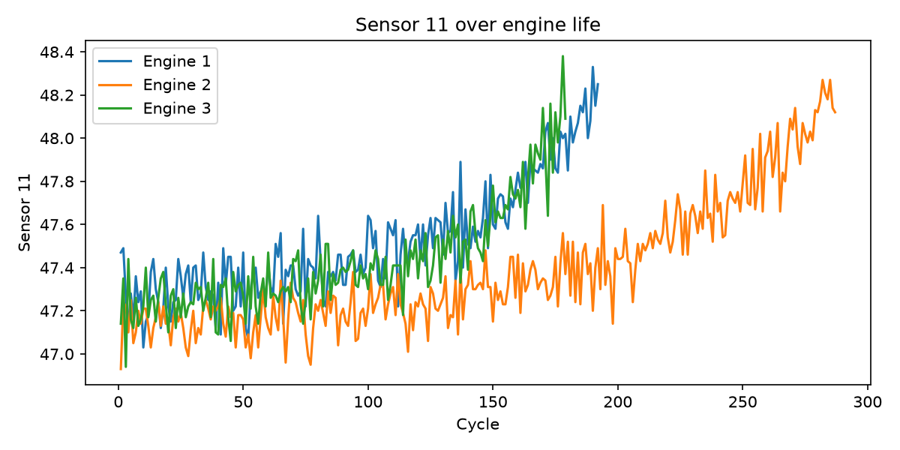
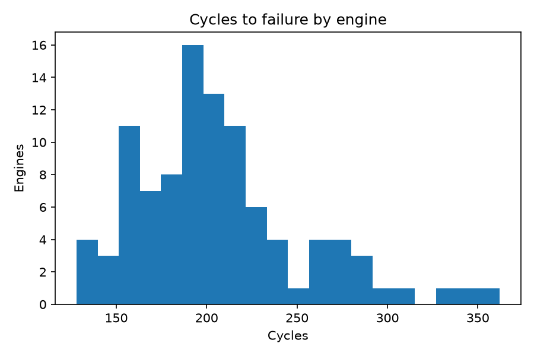

# Test Data Analysis Pipeline

Python and SQL pipeline that ingests raw engine test data, validates and
cleans it, flags anomalies, and summarizes results. Built on NASA's public
C-MAPSS turbofan degradation dataset to mirror a test-program workflow.

## What it does
- Loads raw sensor data (21 sensors, 100 engines, run to failure)
- Runs data-quality checks (missing values, duplicates, constant sensors)
- Flags outlier readings (z-score > 4) instead of deleting them
- Computes remaining cycles before failure per engine
- Exports a summary CSV, charts, and a SQLite database
- Includes SQL queries using CTEs, window functions, and LAG

## How to run
1. Download `train_FD001.txt` from NASA's C-MAPSS dataset into `data/`
2. `pip install pandas matplotlib`
3. `python pipeline.py`
4. Run `queries.sql` against `output/engines.db`

## Sample output

## Findings
Engines ran between 128 and 362 cycles before failure, averaging 206.
Sensor 11 trends upward as engines degrade, which could support early-warning
detection. Roughly 70 of 100 engines had at least one flagged outlier reading.

## Next steps
- Add a Power BI dashboard on the summary data
- Add a MATLAB version of the analysis
- Add unit tests for the cleaning functions

## Tools
Python (pandas, matplotlib), SQL (SQLite)